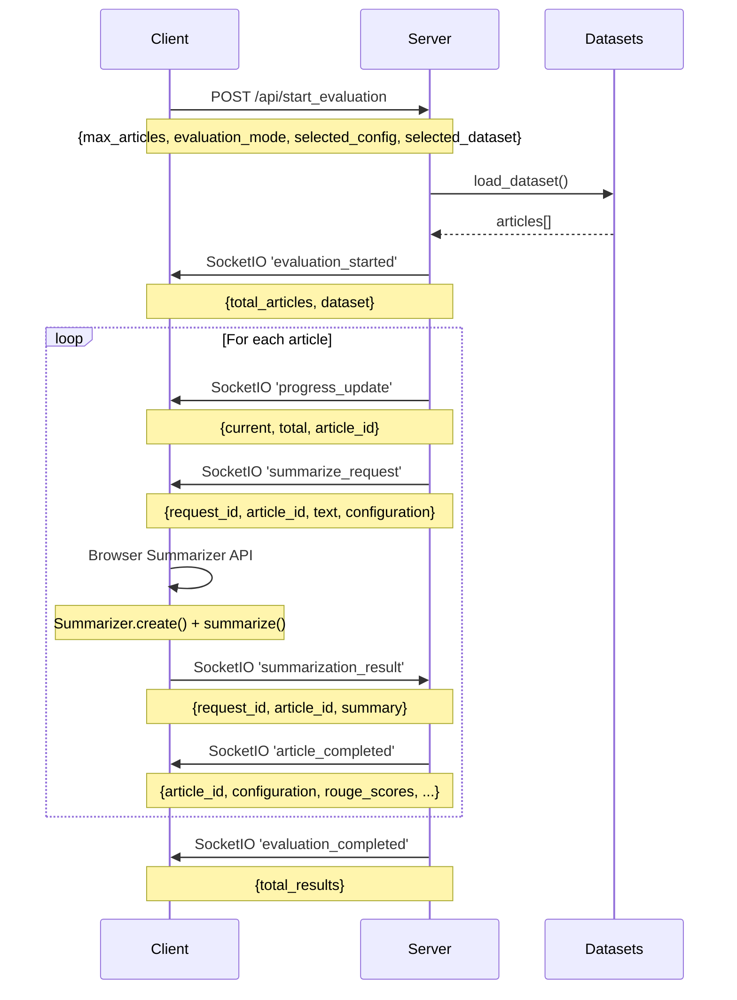
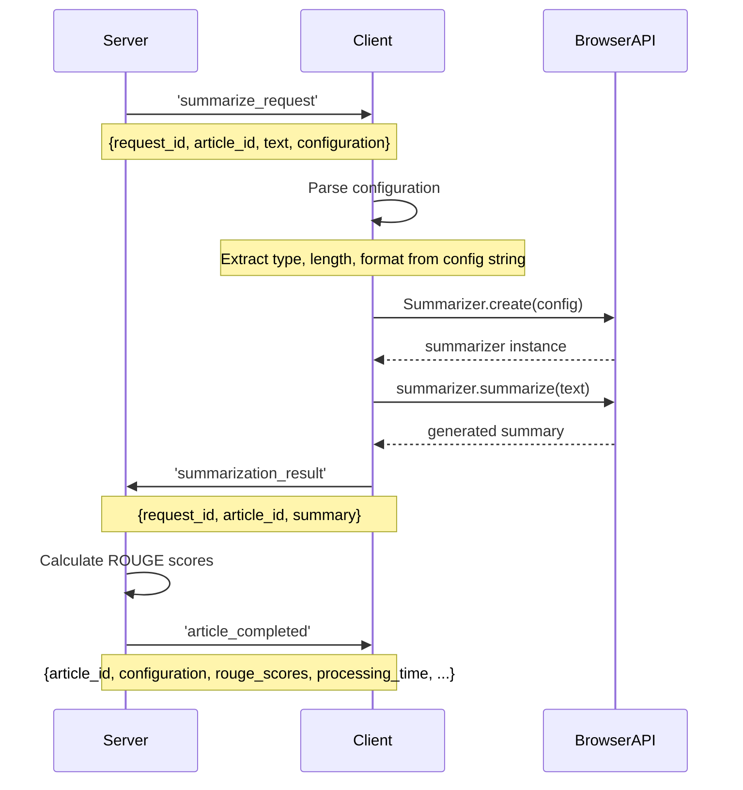

# Browser Summarization Quality Evaluation System - Design Document

## Overview

The Browser Summarization Quality Evaluation System is a web-based application that evaluates the quality of browser-native summarization APIs against reference summaries using ROUGE metrics. The system features a modern Material Design interface with real-time progress tracking and supports both single configuration and comprehensive multi-configuration evaluation modes.

## Architecture Overview

```
┌─────────────────┐    WebSocket/HTTP    ┌──────────────────┐    Dataset APIs    ┌─────────────────┐
│   Browser       │ ◄─────────────────► │   Flask Server   │ ◄─────────────────► │  HuggingFace    │
│   Client        │                     │   (Python)       │                     │  Datasets       │
└─────────────────┘                     └──────────────────┘                     └─────────────────┘
│                                        │
│ • Material UI                          │ • SocketIO Server
│ • Summarizer API                       │ • Dataset Loading
│ • Real-time Updates                    │ • ROUGE Evaluation
│ • Theme Management                     │ • Result Processing
│                                        │
└─ Browser Summarizer API               └─ Results Storage
   • Summarizer.create()
   • Multiple configurations
   • Error handling
```

## Client-Server Communication

### 1. Connection Management

#### WebSocket Connection
- **Protocol**: Socket.IO over WebSocket
- **Endpoint**: `/socket.io/`
- **Auto-reconnection**: Enabled
- **CORS**: Allowed for all origins during development

```javascript
// Client connection initialization
socket = io();

socket.on('connect', function() {
    addLog('Connected to server', 'success');
});
```

#### Connection Events
- `connect`: Client successfully connects to server
- `disconnect`: Client disconnects from server
- `status_update`: Server sends current evaluation state on connect

### 2. HTTP API Endpoints

#### Configuration Endpoints
```
GET /                    - Serves Material UI interface (default)
GET /basic              - Serves basic HTML interface
GET /api/datasets       - Returns available datasets configuration
```

#### Evaluation Control Endpoints
```
POST /api/start_evaluation   - Starts evaluation process
POST /api/stop_evaluation    - Stops ongoing evaluation
GET  /api/results           - Retrieves current results
GET  /api/export_results    - Exports results to CSV
```

### 3. Real-time Communication Flow

#### A. Evaluation Startup Sequence



#### B. Browser Summarization Process



### 4. Data Structures

#### Client to Server Messages

**Start Evaluation Request**
```json
{
  "max_articles": 5,
  "evaluation_mode": "single|all",
  "selected_config": "tldr_short_plain-text",
  "selected_dataset": "cnn_dailymail"
}
```

**Summarization Result**
```json
{
  "request_id": "req_0_tldr_short_plain-text_1234567890",
  "article_id": 0,
  "summary": "Generated summary text...",
  "error": "Error message if failed"
}
```

#### Server to Client Messages

**Progress Update**
```json
{
  "current": 3,
  "total": 5,
  "article_id": 2
}
```

**Summarization Request**
```json
{
  "request_id": "req_0_tldr_short_plain-text_1234567890",
  "article_id": 0,
  "text": "Full article text...",
  "configuration": "tldr_short_plain-text"
}
```

**Article Completed**
```json
{
  "article_id": 0,
  "configuration": "tldr_short_plain-text",
  "article_length": 1500,
  "reference_summary": "Reference summary...",
  "generated_summary": "Generated summary...",
  "rouge_scores": {
    "rouge1": 0.456,
    "rouge2": 0.234,
    "rougeL": 0.398
  },
  "compression_ratio": 0.12,
  "processing_time": 1.45,
  "timestamp": "2025-07-09T10:30:45.123Z",
  "source": "browser_api"
}
```

### 5. Error Handling & Fallbacks

#### Browser API Failures
1. **Timeout Handling**: 30-second timeout for each summarization request
2. **Mock Fallback**: If browser API fails, server generates mock results for demonstration
3. **Graceful Degradation**: System continues evaluation even if individual requests fail

#### Network Issues
1. **Auto-reconnection**: Socket.IO automatically attempts to reconnect
2. **State Synchronization**: Server sends current state on reconnection
3. **Progress Recovery**: Client can resume from current progress state

### 6. Configuration Management

#### Evaluation Modes

**Single Configuration Mode**
- Uses user-selected configuration (type, length, format)
- Processes one configuration per article
- Faster evaluation for specific use cases

**All Configurations Mode**
- Tests all 36 possible combinations:
  - Types: `tldr`, `key-points`, `teaser`, `headline` (4)
  - Lengths: `short`, `medium`, `long` (3)
  - Formats: `plain-text`, `markdown` (2)
  - Total: 4 × 3 × 2 = 24 combinations per article

#### Dataset Support
- **Built-in Sample**: Fallback articles for testing
- **CNN/DailyMail**: News article summarization
- **XSum**: BBC article summarization
- **Multi-News**: Multi-document summarization
- **Reddit TIFU**: Social media summarization
- **WikiHow**: Instructional summarization

### 7. Performance Considerations

#### Client-Side Optimizations
- **Lazy Loading**: Material Design components initialized on demand
- **Throttled Updates**: UI updates batched to prevent excessive redraws
- **Memory Management**: Summarizer instances destroyed after use
- **Visual Feedback**: Real-time progress indicators and table highlighting

#### Server-Side Optimizations
- **Threading**: Evaluation runs in background thread
- **Request Queuing**: Pending requests tracked with unique IDs
- **Memory Efficient**: Results streamed as they complete
- **Configurable Delays**: Prevent overwhelming browser API

### 8. Security Considerations

#### Input Validation
- Maximum article limits enforced
- Dataset validation against whitelist
- Configuration string parsing with fallbacks

#### CORS Policy
- Development: Permissive for testing
- Production: Should be restricted to specific domains

### 9. Monitoring & Logging

#### Client-Side Logging
- **System Logs**: Connection status, evaluation progress, errors
- **Input Data Logs**: Article content being processed (collapsible)
- **Output Data Logs**: Generated summaries and ROUGE scores (grouped by article)

#### Server-Side Logging
- **Request Tracking**: All API calls and Socket.IO events
- **Performance Metrics**: Processing times and throughput
- **Error Reporting**: Detailed error context and stack traces

### 10. Future Enhancements

#### Potential Improvements
1. **Authentication**: User accounts and saved evaluations
2. **Batch Processing**: Queue multiple evaluations
3. **Custom Datasets**: User-uploaded evaluation datasets
4. **Advanced Metrics**: Beyond ROUGE (BLEU, METEOR, BERTScore)
5. **Visualization**: Interactive charts and comparison tools
6. **Export Formats**: JSON, Excel, detailed reports

#### Scalability Considerations
1. **Database Integration**: Persistent result storage
2. **Load Balancing**: Multiple server instances
3. **Caching**: Result caching for repeated evaluations
4. **API Rate Limiting**: Prevent abuse of evaluation endpoints

## Conclusion

The system provides a robust, real-time evaluation platform for browser summarization APIs with excellent user experience through Material Design interface and comprehensive error handling. The WebSocket-based communication ensures responsive updates while the modular architecture supports easy extension and maintenance.
